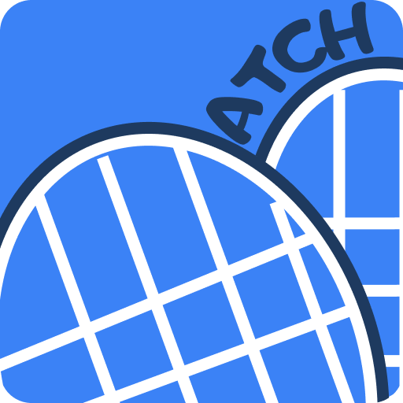
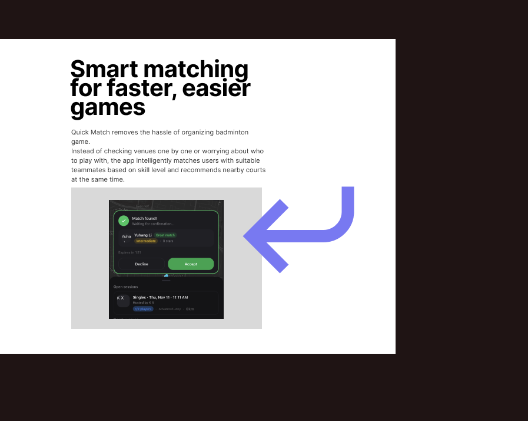
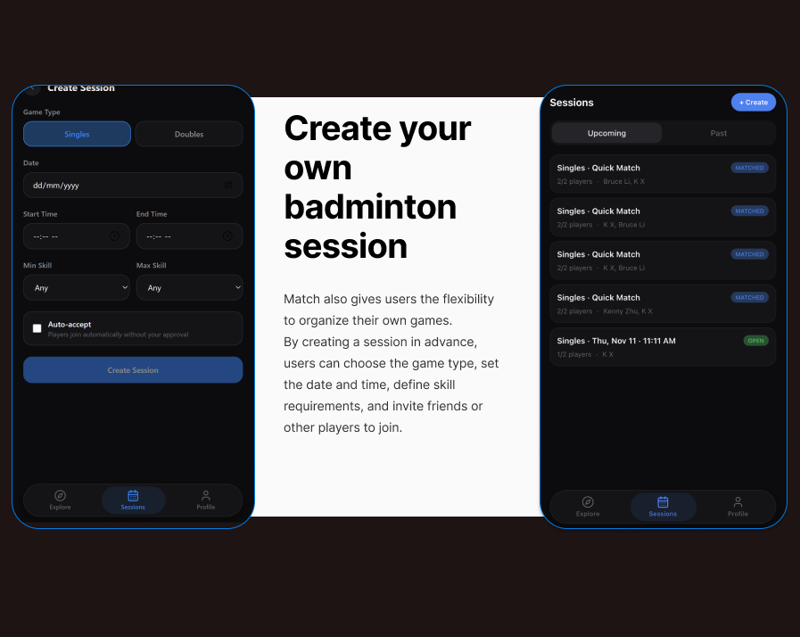
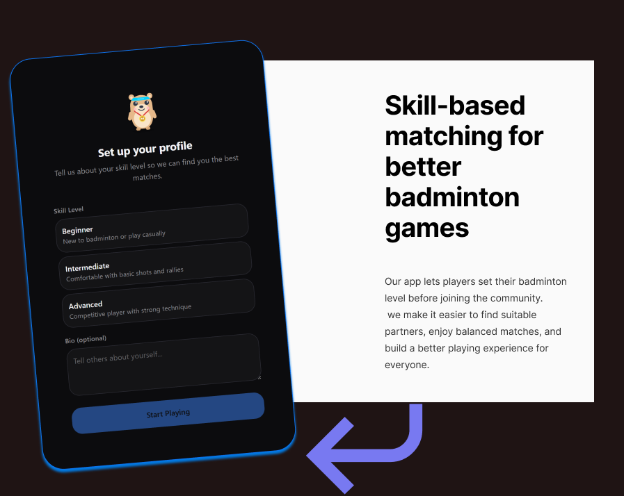
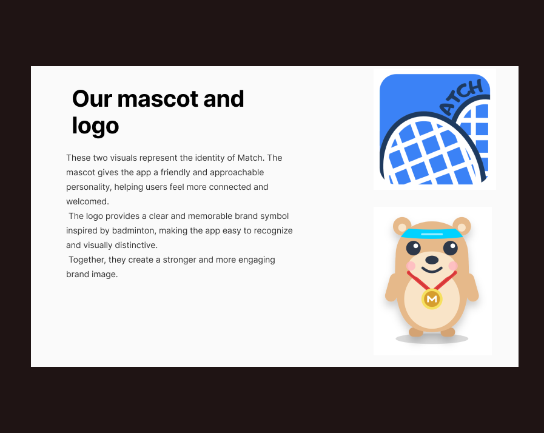

<p align="center">
  
</p>

<h1 align="center">Match</h1>

<p align="center">
  <em>Swipe less, play more.</em>
</p>

<p align="center">
  A mobile-first web app that instantly connects badminton players to each other and to nearby courts.
  <br />
  Think <strong>Uber meets pick-up sport</strong> — tap a button, get matched, and start playing.
</p>

<p align="center">
  Built for <strong>UNIHACK 2025</strong>
</p>

---

## The Problem

If you've ever wanted to play a casual game of badminton, you know the pain. You scroll through dozens of Facebook groups — most are inactive, poorly organised, or filled with players way above or below your level. Even when you find a group that looks right, you're hit with logistics: coordinating schedules, finding a court, splitting payments, and arranging transport. For many people, the search alone eats up the free time they wanted to spend playing.

For beginners, it's worse. Jumping into an unknown pick-up group feels intimidating, and the fear of being judged pushes newcomers away from the sport entirely — robbing them of experiences that could genuinely improve their game and their wellbeing.

We live in an era where it's easier to queue up for a League of Legends match than to organise a real-world game with real people. **That felt wrong to us.** We believe technology should make it effortless to get off the couch, meet your neighbours, and experience the magic of community through sport.

---

## What Match Does

Match handles the entire journey from "I want to play" to "good game" — matchmaking, venue booking, payments, and communication in one seamless flow.

### Quick Match — Play Right Now

Tap the hero card, choose Singles or Doubles, and enter a live queue. The system scores candidates on **availability, proximity, sportsmanship, and skill level**, then proposes a mutual match. Once all slots are filled, the top three nearby venues are surfaced and everyone confirms a court within minutes.

<p align="center">
  
</p>

### Schedule Match — Plan a Game

Create a session for a future date and publish it as an open lobby. Other players browse and request to join. If the session isn't full an hour before game time, the system **auto-fills** empty slots so no one is left hanging.

<p align="center">
  
</p>

### The Full Session Lifecycle

| Stage | What Happens |
|-------|-------------|
| **Matching** | Real-time scoring and mutual confirmation between players |
| **Venue Selection** | Top 3 courts ranked by midpoint proximity, availability, and price |
| **Booking & Payment** | Stripe checkout with automatic cost splitting across all players |
| **Group Chat** | Real-time messaging so players can coordinate |
| **Play** | Get out there and have fun |
| **Rate & Review** | Sportsmanship ratings feed back into future match quality |

### For Venue Merchants

Venue owners list their courts, manage availability and pricing, offer upsell items (equipment rentals, refreshments), and track revenue — all from a dedicated merchant dashboard. Match earns a commission on every booking, aligning our incentives with theirs.

---

## The Matching Algorithm

Every candidate is scored on four weighted factors:

| Factor | Weight | Why |
|--------|--------|-----|
| Availability overlap | 40% | No point matching people who can't play at the same time |
| Geographic distance | 30% | Closer players mean less travel friction |
| Sportsmanship rating | 20% | Good vibes matter for a healthy community |
| Skill level proximity | 10% | Deliberately lowest — getting a game happening matters more than perfect competitive balance |

The system uses a **dual-path matching** approach:
- **Auto-match**: When a candidate's composite score exceeds the threshold, both players receive a mutual confirmation prompt
- **Manual pick**: Players can also browse suggestion cards in the feed and send match requests directly

If both paths fire simultaneously, the system match takes priority to prevent race conditions.

### Skill-Based Onboarding

Players set their skill level during onboarding so the algorithm can factor it into match quality from day one — while keeping the weight low enough that no one is blocked from getting a game.

<p align="center">
  
</p>

---

## The Explore Screen

The app's home view is designed to feel native despite being a web app:

- **Full-screen Mapbox map** showing nearby venue pins and active player dots
- **Pull-up bottom sheet** with a mixed feed of venues, open sessions, and player suggestions
- **Hero card overlay** that transitions through six colour-coded states — from Idle (blue) to Searching (pulsing blue) to Confirmed (green) to Venue Selection (amber)
- The feed **never locks** — players can browse while Quick Match runs in the background

<p align="center">
  
</p>

---

## Tech Stack

| Concern | Technology |
|---------|-----------|
| **Framework** | Next.js 16 (App Router, TypeScript) |
| **API** | tRPC 11 + TanStack React Query |
| **Database** | Supabase (Postgres) + Prisma ORM |
| **Auth** | Supabase Auth (Google & Apple OAuth) |
| **Real-time** | Supabase Realtime (WebSocket) |
| **UI** | Tailwind CSS 4 + shadcn/ui (Radix Primitives) |
| **Maps** | Mapbox GL JS |
| **Payments** | Stripe Checkout + Stripe Connect |
| **Push Notifications** | Web Push API + Service Workers |
| **Validation** | Zod (shared client/server schemas) |
| **Code Quality** | Biome |

### Architecture

The backend follows a strict **layered service architecture** where code flows downward only:

```
tRPC Routers       →  Auth, validation, return results
     ↓
Use-Cases          →  Orchestrate multiple services for one user action
     ↓
Services           →  Single-responsibility domain logic
     ↓
Adapters           →  Thin wrappers around external SDKs
```

This separation keeps business logic testable and independent of the transport layer. Services never call each other — if an operation needs two services, it belongs in a use-case.

### Design System

The UI is **dark-mode only** with a sophisticated, minimalist foundation inspired by Uber and Linear. Strategic bursts of personality come through Ace (the mascot), colour-coded state transitions, and micro-animations at emotional peaks — finding a match, confirming a booking, celebrating a game.

The hero card's six-state colour system provides instant visual feedback:
- **Electric Blue** (`#3B82F6`) — searching and active states
- **Match Green** (`#22C55E`) — confirmed matches
- **Venue Amber** (`#F59E0B`) — venue selection phase
- **Danger Red** (`#EF4444`) — cancellations and errors

---

## Challenges We Overcame

**Real-time matching is a concurrency problem.** Two players can't both accept the same candidate simultaneously, and a system auto-match arriving while a manual request is pending has to cleanly take priority without leaving orphaned state. We modelled the session lifecycle as a finite state machine with eight distinct states and mapped every edge case before writing matching logic.

**Dual-path matching introduces subtle race conditions.** Both auto-match and manual feed pick funnel into the same confirmation flow but have different timeout semantics and priority rules. Getting mutual confirmation, one-directional requests, and two-minute response windows to coexist required careful orchestration through Supabase Realtime channels.

**Payment splitting is harder than it looks.** Evenly splitting a court booking plus variable per-player upsells — while deducting platform commission and routing payouts to merchants via Stripe Connect — required structuring the checkout flow so every cent is accounted for and refund logic works cleanly when sessions are cancelled.

---

## What We're Proud Of

- A **complete end-to-end session lifecycle**: from tapping Quick Match through real-time scoring, mutual confirmation, venue selection, payment processing, in-game chat, and post-session ratings. Every state transition is accounted for — including cancellations, backfills, and timeouts.

- An Explore screen that **genuinely feels like a native app**. The hero card's six-state colour transitions, the persistent bottom sheet feed, and Mapbox integration with live venue pins and player dots create a fluid experience despite being a web application in a mobile browser.

- A **fully functional two-sided marketplace** built in hackathon time. Merchants onboard through Stripe Connect, manage courts and upsells, and view revenue analytics — while players enjoy seamless booking and automatic payment splitting.

---

## What's Next

Our MVP is scoped to badminton, but the architecture is **sport-agnostic**. The roadmap includes:

- **More sports** — tennis, basketball, futsal — each with their own session formats and player counts, using the same core matching engine
- **ELO-style skill ratings** that passively improve match quality over time, replacing self-reported skill levels with data-driven assessments
- **Social features** — friend lists, activity feeds, and recurring playgroups
- **Tournament & league tools** for venues to host competitive events
- **Transportation coordination** — because the last mile to the venue shouldn't be the reason someone skips a game

---

## Team

Built with care at UNIHACK 2025.

---

<p align="center">
  <em>"We want to promote individuals of any sporting calibre about the beauty and magic of community through sport."</em>
</p>
